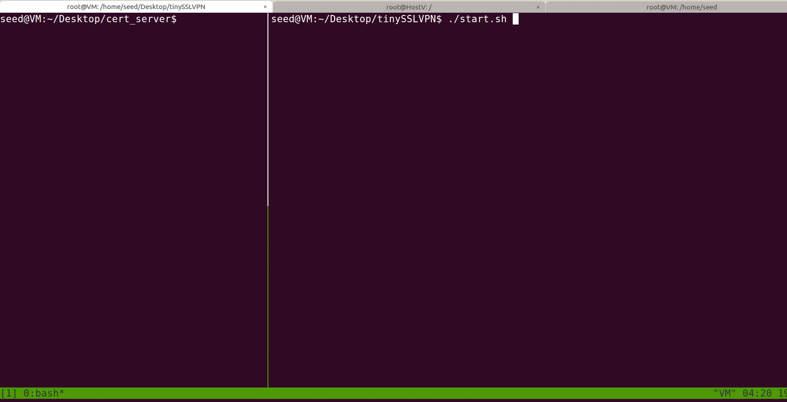

# tinyTLSVPN

## 环境搭建

### docker

seedubuntu16.04(32 bit)虚拟机 --VPNServer运行  
`sudo sysctl net.ipv4.ip_forward=1` 开启ip转发  
`sudo iptables -F`      关闭防火墙  

docker 创建网络extranet  
`sudo docker network create --subnet=10.0.2.0/24 --gateway=10.0.2.8 --opt "com.docker.network.bridge.name"="docker1" extranet`  
docker 创建网络intranet  
`sudo docker network create --subnet=192.168.60.0/24 --gateway=192.168.60.1 --opt "com.docker.network.bridge.name"="docker2" intranet`  
docker 创建并运行HostV  
`sudo docker run -it --name=HostV --hostname=HostV --net=intranet --ip=192.168.60.101 --privileged "seedubuntu" /bin/bash`  
docker 创建并运行HostU  
`sudo docker run -it --name=HostU --hostname=HostU --net=extranet --ip=10.0.2.7 --privileged "seedubuntu" /bin/bash`  
  
如果测试多客户端连接，可以创建更多客户端容器  
所有容器进入后需要删除原始路由`route del default`，否则可以直接ping通  
HostV上增加路由 `route add -net 192.168.48.0/21 gw 192.168.60.1 eth0`  

**如果实验没有效果，可以使用wireshark抓包或者tcpdump在HostV抓包，确定数据包能够被转发（由于未知原因，虚拟机死活不转发，重装了...）**

### openssl 证书生成  

openssl生成证书,可以从`/usr/lib/ssl/openssl.cnf`获取配置文件的副本,根据文件中CA default部分创建好文件夹和文件  
先行修改openssl.cnf中的`policy=policy_match`改为`policy_anything`，否则必须保证名称全部相同(显然很麻烦)  
然后生成证书相关指令如下  
- 为CA生成自签名证书  
`openssl req -new -x509 -keyout ca.key -out ca.crt -config openssl.cnf`  
- 生成服务器密钥文件  
`openssl genrsa -des3 -out server.key 1024`  
- 根据密钥文件生成证书签名请求CSR  
`openssl req -new -key server.key -out server.csr -config openssl.cnf`  
- 使用我们自己的可信CA以及上步中生成的CSR来生成证书  
`openssl ca -in server.csr -out server.crt -cert ca.crt -keyfile ca.key -config openssl.cnf`  
客户端步骤雷同，不再赘述。  
- 此外，我自己实现了自动化生成证书的脚本 initfiles.sh 和 autogenerate.expect  
需要环境支持 `sudo apt-get install tcl tk expect`  
在文件夹中先修改autogenerate.expect中的参数配置，然后./initfiles.sh一键生成证书 
## 数据传输整体流程  
大概画了个草图，如下图  

## 代码功能

实现功能如下  
1. make一键编译, make run一键运行(把程序与证书复制到指定docker容器中)
2. initfiles.sh 一键生成openssl证书
3. ./kill.sh 脚本kill进程
4. 服务器为客户端分配路由并告知内网主机子网
5. 利用ioctl实现自动为Tun0设置ip，客户端自动增添路由
6. 实现了ip的可回收，即client端关闭后回收为其分配的ip资源
7. 可分配ip改为192.168.48.0/21 (大概有2000多个ip可分配)
8. 每次读写任务封装为function，实现基于C++11的线程池执行任务
9. server端改用epoll监听文件描述符
---
**~~最后三点纯属没用，越写越远了~~**

如果单纯满足多个客户端任务的话，多线程其实都是没有必要的，我们只需要
监听文件描述符，有事件到来就处理即可，很简单就可以实现

**谨记YAGIN原则，扼杀对未来代码功能的预见，You're NOT Goona Need It!**  
srds  待实现功能
1. 调试信息太多未清理
2. ssl认证部分随便写的，能跑就没仔细管
3. autogenerate脚本临时写的，可能有错误风险，跑完了检查是否有空文件，有的话就失败了
4. 希望客户端增加信号处理函数，kill完事后，调用close优雅关闭连接  
5. ~~如果将来闲的蛋疼的时候，兴许再写个压力测试~~

## 运行流程

开启docker中的容器  
`HostV : route del default && route add -net...`  
`HostU and other client : route del default`  

`cd cert_server`  
修改autogenerate.expect中的信息，尤其注意其中的phrase  
`./initfiles.sh` 生成证书  
`cd ..`  
修改passwd中的内容为autogenerate.expect中的server的phrase  
修改Makefile中的 TARGETDOCKERHOST 参数(确保copy到docker中)  
`make run` 或者 `make` 自行copy到容器，./start.sh运行server  

容器中同样推荐编写脚本以重定向方式输入phrase(守护进程手动输入不太友好  
**client端接受一个命令行参数 目的主机ip(即server所在主机)**
连接完成可以使用ping 或 telnet (HostV需开启服务)  
kill掉某个容器中的进程，测试服务器稳定性

演示效果如下

##
